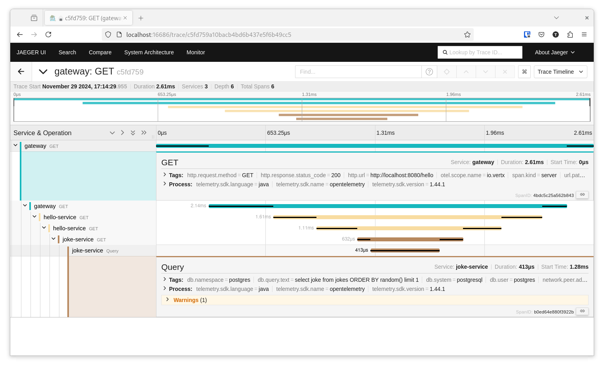

= Vert.x OpenTelemetry example

Here you will find an example demonstrating Vert.x OpenTelemetry in action.

Please consult the Vert.x OpenTelemetry manual for the detailed documentation.

== Microservices

This example shows a couple simple microservices monitored with Vert.x OpenTelemetry.

=== Joke service

The Joke service provides an HTTP microservice for jokes stored in PostgreSQL.

The HTTP server and the database client contribute traces.

You can query this service with `curl`:

[source,shell]
----
curl http://localhost:8082
----

=== Hello service

The Hello service provides an HTTP microservice for saying hello.
This service uses the Joke service to tell the user a joke.

The HTTP server and the HTTP client contribute traces.

You can query this service with `curl`:

[source,shell]
----
curl http://localhost:8081
----

=== Gateway

The Gateway is a simple HTTP gateway that exposes both Joke and Hello services.

The HTTP server and the HTTP client contribute traces.

You can query this service with `curl`:

[source,shell]
----
curl http://localhost:8080/hello
curl http://localhost:8080/joke
----

== Jaeger server

Jaeger is an open source, distributed tracing platform, compatible with OpenTelemetry.

Start a https://www.jaegertracing.io[Jaeger] server:

[source,shell]
----
docker run --rm --name jaeger \
  -p 5778:5778 \
  -p 16686:16686 \
  -p 4317:4317 \
  -p 4318:4318 \
  -p 14250:14250 \
  -p 14268:14268 \
  -p 9411:9411 \
  jaegertracing/jaeger:2.0.0 \
  --set receivers.otlp.protocols.http.endpoint=0.0.0.0:4318 \
  --set receivers.otlp.protocols.grpc.endpoint=0.0.0.0:4317
----

Jaeger provides a visual http://localhost:16686[console]

You can run the _Hello_, _Joke_ and _Gateway_ services in your IDE with link:src/main/java/io/vertx/example/otel/OpenTelemetryExample.java[OpenTelemetry Example]

Or you can start them separately:

- link:src/main/java/io/vertx/example/otel/Gateway.java[Gateway]
- link:src/main/java/io/vertx/example/otel/HelloService.java[Hello service]
- link:src/main/java/io/vertx/example/otel/JokeService.java[Joke service]
